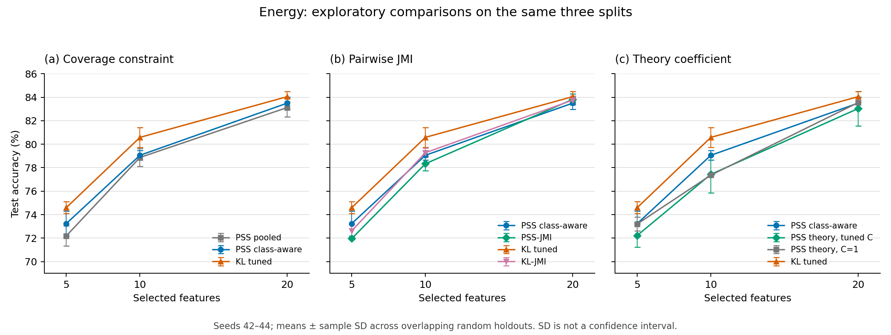

# Energy experiments and compact saved results

This directory publishes the completed UCI Appliances Energy experiments with
their saved tables, protocol records, audits, and figures. The experiment sources
in the adjacent directories are copied unchanged from the runs. The full raw
prediction and classifier caches are omitted from this compact Git export.



## Studies and files

| Study | Source | Saved tables and audits | Splits |
| --- | --- | --- | --- |
| Initial same-period selection | [energy_sameperiod](../energy_sameperiod) | [results](results/energy_sameperiod_20261005) | Seeds 42–46 |
| Expanded coverage/fold grid and tuned kNN | [energy_sc_expansion](../energy_sc_expansion) | [results](results/energy_sc_expansion_20261005) | Seeds 42–46 |
| Class-aware coverage constraint | [energy_component_guard](../energy_component_guard) | [results](results/energy_component_guard_20261005) | Seeds 42–44 |
| Pairwise JMI comparison | [energy_jmi](../energy_jmi) | [results](results/energy_jmi_20261006) | Seeds 42–44 |
| Theory-rate coefficient calibration | [energy_theory_c](../energy_theory_c) | [results](results/energy_theory_c_20261006) | Seeds 42–44 |

The shared Ross MI helper is [energy_v2/core.py](../energy_v2/core.py).

Supplemental SC selection diagnostics from
[diagnose_selection.py](../energy_sameperiod/diagnose_selection.py) are retained in
[the initial diagnostic tables](results/energy_sc_diagnostic_20261005) and
[the second diagnostic tables](results/energy_sc_diagnostic_20261005_r2). These
contain candidate tables, denominator-only comparisons, and fixed-path
sensitivity results; the second set also has a summary JSON. They supplement
the five main studies and do not have separate passed full-study audit records.
Each result directory retains every top-level CSV and JSON file, any `REPORT.md`,
and the original `plots/` previews. The six existing vector PDFs from the initial
and expanded studies are under [figures/original](figures/original).
The newly assembled [comparison PDF](figures/energy_accuracy_comparison.pdf)
uses the three later studies' bundled summary tables.

## Design and interpretation

The dataset has 19,735 observations from one household and 25 predictors after
excluding date, the Appliances target, and two random variables. The binary
target is Appliances above the training median. Random outer 70:30 train/test
splits contain a further 70:30 inner training/validation split. Preprocessing,
feature selection, and selector tuning use training data. Classifier settings
are shared fixed RBF SVM settings; test scores do not select feature counts or
hyperparameters. Full details and source/data hashes are in each `protocol.json`.

These are exploratory same-period random-row experiments, including successive
extensions on previously inspected splits. They do not establish forecasting
or new-household generalization. Mean ± sample SD describes variability across
overlapping splits, not independent-subject confidence intervals. Smoothing and
high coverage do not demonstrate that the density theorem's assumptions hold.
Entropy-difference scores are left unmodified and are not calibrated MI values.
Reused workflow timings are not estimator runtime benchmarks.

## Main three-split comparisons

Test accuracy (%), mean ± sample SD over seeds 42–44:

| Selector | 5 features | 10 features | 20 features |
| --- | ---: | ---: | ---: |
| PSS pooled SC-CV | 72.20 ± 0.87 | 78.87 ± 0.75 | 83.12 ± 0.80 |
| PSS class-aware SC-CV | 73.24 ± 1.07 | 79.06 ± 0.41 | 83.50 ± 0.53 |
| PSS-JMI | 71.96 ± 0.09 | 78.34 ± 0.58 | 83.82 ± 0.48 |
| KL tuned | 74.60 ± 0.50 | 80.58 ± 0.85 | 84.05 ± 0.45 |
| KL-JMI | 72.63 ± 0.52 | 79.28 ± 0.38 | 83.75 ± 0.37 |
| PSS theory, tuned C | 72.23 ± 0.98 | 77.44 ± 1.57 | 83.04 ± 1.47 |
| PSS theory, C=1 | 73.21 ± 0.59 | 77.37 ± 0.10 | 83.54 ± 0.45 |

The class-aware constraint modestly raises the reported means over pooled
coverage in this comparison. Pairwise JMI lowers PSS accuracy at 5 and 10
features and raises it slightly at 20, where its mean remains below tuned KL.
JMI also lowers the tuned-KL means. These results do not support a general
advantage for replacing the existing selectors with JMI.

Theory calibration selects C=2.5,3,2.5 for the three seeds. It uses
`ell = max(1, floor(C * (n / (d^6 * log(n)^2))^(1/(d+8)) + 0.5))`, with natural
logarithm, upward half rounding, pooled sample size, and one common ell for the
three entropy components. At 5,10,20 features, tuned C chooses ell=2 while C=1
chooses ell=1. Its accuracy changes relative to C=1 are −0.98,+0.07,−0.51
percentage points. Avoiding ell=1 does not resolve the observed instability.
The exact coverage and score diagnostics remain in the saved tables.

The plot compares only these matched three-split summaries. Initial and expanded
five-split means are retained separately and are not mixed into that comparison.

## Regenerate the compact figure

From the repository root, using Python 3.10 or newer:

```sh
python -m pip install -r experiments/energy_results_20261006/requirements.txt
python experiments/energy_results_20261006/plot.py --verify-only
python experiments/energy_results_20261006/plot.py --output-dir /tmp/pss-energy-figures
```

The plot requires only matplotlib beyond the standard library. It has no dataset,
compiler, archived-repository, or fitted-model dependency. `--output-dir` writes a
PDF, PNG, and `plot_checks.json` elsewhere for validation; omitting it regenerates
the new files under `figures/` without changing the saved original figures.

`manifest.json` records SHA-256 values for 22 copied source files and 98 copied
result/figure artifacts. Both plot commands check all these hashes before doing
anything else. Successful checks establish byte-for-byte export integrity.
They do not independently verify the original estimators or recompute the saved
metrics. New figure checks record 33 plotted method/count summary rows.

## Saved audits and reproducibility limits

All five studies contain historical `audit.json` records with `passed: true`.
Their recorded scope differs: for example, the JMI audit checked 75 development
paths, six new outer paths, and 975 PSS plus 975 KL outer singleton/pair scores;
the theory-C audit checked 18 development paths, six outer paths, and 1,860 outer
candidate scores. Both checked saved test predictions. Historical inner metrics
without stored predictions are explicitly distinguished from prediction-verified
records in those audits. Those are saved run-time claims, not audits newly
replayed for this publication. The publication checks transfer hashes and
regenerates the compact comparison figure from saved summaries. Fresh publication
checks also built the canonical library, passed its three density tests and all
38 Energy unit tests (10 same-period, 5 expansion, 7 guard, 8 JMI, 8 theory-C),
and verified the bundled dataset's shape and archived protocol hashes. Those
small tests do not replay the full original scientific audits.

This export is sufficient to inspect the reported results and regenerate the
compact figure. It is not a complete replay bundle:

- Raw per-split checkpoints, selection paths, classifier caches, and prediction
  arrays are omitted. Consequently the original `analyze.py` audits cannot be
  rerun solely from these compact tables.
- Original runners expect `data/energydata_complete.csv` and full run directories
  under repository-root `results/`, not this compact export. This repository
  includes the unchanged [Energy CSV](../../data/energydata_complete.csv), with
  source attribution in [data/README.md](../../data/README.md), from the
  [UCI Appliances Energy dataset](https://archive.ics.uci.edu/dataset/374/appliances+energy+prediction).
  Check its hash against the archived protocol before claiming an exact
  reproduction; copying the compact tables into `results/` is insufficient.
- Expansion can run independently. Guard depends on full expansion results;
  JMI depends on full guard and expansion results; theory-C also depends on full
  JMI results. Expansion analysis optionally checks earlier same-period paths
  when their checkpoints exist. Recreating that dependency chain requires the
  original full results or running its prerequisite studies in order.
- Saved protocols and cache references preserve absolute historical paths.
  They have not been rewritten because that would change the frozen provenance.
  A relocated full archive needs an explicit path-mapping procedure before its
  original audit/reuse commands can work.
- Guard's original runner hashes the macOS file `PSS/libpss_v2.dylib`; that hash
  is inherited by later protocols. Linux builds produce `.so`, and recompilation
  can change binary hashes even on macOS. These unchanged scripts and archived
  protocols need a separately documented platform adaptation for fresh runs on
  another environment. Never replace historical hashes and claim the original
  audit still verifies them.
- All source files are frozen byte-for-byte. Before full reruns, verify the
  compatible canonical `PSS/pss_v2.py` and `.cpp` hashes against the protocols;
  build with `python PSS/build_pss_v2.py`. The compact plot does not depend on
  those estimator files.

The original environment was Python 3.11.5, NumPy 1.24.3, SciPy 1.11.1,
pandas 2.0.3, scikit-learn 1.3.0, and matplotlib 3.7.2 on macOS arm64.
A C++17 compiler is required for full estimator runs. The repository's
[exact-version environment](../requirements-energy-synthetic.txt) matches those
recorded package versions. Dependency minimums in this directory's
`requirements.txt` are convenience installation bounds, not a claim of exact
numeric reproducibility across versions.

Each source directory with tests can be checked in a separate process after
building the compatible canonical estimator, for example:

```sh
python -m unittest discover -s experiments/energy_sameperiod -p 'test_*.py'
python -m unittest discover -s experiments/energy_sc_expansion -p 'test_*.py'
python -m unittest discover -s experiments/energy_component_guard -p 'test_*.py'
python -m unittest discover -s experiments/energy_jmi -p 'test_*.py'
python -m unittest discover -s experiments/energy_theory_c -p 'test_*.py'
```

The source tree preserves each experiment's original CLI. Consult the protocol
and code before expensive execution; a successful compact plot is not evidence
that the omitted full experiment chain has been reproduced.
