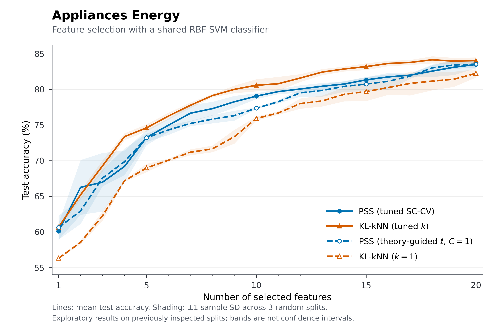

# Figure 5: four-method Energy feature selection

This portable package reproduces the four Energy curves for all 1–20 selected
feature counts. It retains the methods, labels and styling of the original
`experiments/energy_theory_c/plot_four_methods.py` from the full study workspace.
No estimator, feature path, classifier, hyperparameter or experimental result
was changed for this export.



| Curve | Saved selector |
| --- | --- |
| PSS (tuned SC-CV) | Class-aware SC-CV (`PSS class-aware SC-CV`) |
| KL-kNN (tuned k) | Inner-validation selection of k (`KL tuned`) |
| PSS (theory-guided ell, C=1) | Fixed theory-rate coefficient (`PSS theory C=1`) |
| KL-kNN (k=1) | Fixed k (`KL k=1`) |

The tuned PSS curve is class-aware SC-CV. The separate experiment that tuned the
theory-rate coefficient C is not one of these four curves. KL-kNN identifies
the entropy estimator; all four classifiers use the same RBF SVM.

## Reproduce or verify

Use Python 3.11; the requirement versions match the original Python 3.11.5
environment. From the repository root:

```sh
python -m pip install -r experiments/paper_figures/figure5/requirements.txt
python experiments/paper_figures/figure5/plot.py --verify-only
python experiments/paper_figures/figure5/plot.py --output-dir /tmp/pss-figure5
python -m unittest discover -s experiments/paper_figures/figure5 -p 'test_*.py'
```

`--verify-only` writes no files and needs only NumPy and pandas. Plotting also
needs Matplotlib; it writes PDF, PNG, SVG, the 80 plotted data rows, and
`figure_checks.json`. Omitting `--output-dir` regenerates `figures/` here.
Data paths are relative to the script. From another working directory, invoke
the script by its absolute path, for example `python /path/to/figure5/plot.py
--verify-only`. Copying this entire `figure5/` directory elsewhere also works.
There is no compiled estimator, external archive or model-training dependency.

## What is independently checked

`data/predictions.npz` contains the saved binary predictions with axes
`[method, seed, selected-feature count, test row]`, the three original outer
train/test index arrays, and the 19,735 Appliances target values. The other NPZ
arrays explicitly name the methods, seeds (42–44) and counts (1–20).
The complete prediction export and provenance are about 300 KB.

Before plotting, the verifier:

1. Checks SHA-256 hashes for the NPZ and two compact CSVs, their coordinates,
   and that each split partitions all dataset rows exactly once.
2. Recomputes each binary label as Appliances greater than the **outer-training
   median**, using 13,814 training rows and 5,921 test rows per split.
3. Recomputes all **240 accuracies** from the saved binary predictions and
   compares them with `data/metrics.csv` to absolute tolerance 1e-14.
4. Recomputes all **80 means and sample standard deviations** (`ddof=1`) across
   the three seeds and compares them with `data/summary.csv`.
5. When the repository's `data/energydata_complete.csv` is present, checks its
   original hash and exact agreement with the exported target vector. A
   standalone directory uses the hash-checked vector; the check report records
   whether the full CSV was available.

Tests exercise relocated verification/plotting (including shallow paths), a corrupted-file hash, and a
changed prediction with an updated file hash that must still fail accuracy
recomputation. Export source and original source/data hashes in
`data/provenance.json` use logical repository-relative archive names. Those
archival files are provenance references, not runtime dependencies.

## Scope and provenance

This checks saved predictions and summary arithmetic. It does **not** retrain
the SVM, rerun feature selection, or replay the omitted full historical audits.
The three splits overlap and were previously inspected during exploratory
work; shading is ±1 sample SD across splits, not a confidence interval. These
same-period, single-household classification results do not establish future
forecasting or new-household performance.

The original export first passed the full workspace's unchanged
`plot_four_methods.py:load_verified`, including original prediction hashes,
outer records, labels and all plotted statistics. `export_from_archive.py`
documents that maintainer-only step. Re-exporting requires the original full
workspace and its original verifier; ordinary reproduction never runs it:

```sh
python experiments/paper_figures/figure5/export_from_archive.py \
  --archive-root /path/to/full-original-workspace --output-dir /tmp/figure5-data
```

The prediction export stores binary predictions only, excluding probabilities,
fitted classifiers, caches and complete feature-selection histories. Hash
checks establish file integrity; they do not establish independent scientific
validation of the original fitted models.

The target vector comes from Candanedo, L. (2017), *Appliances Energy
Prediction*, UCI Machine Learning Repository, DOI
[10.24432/C5VC8G](https://doi.org/10.24432/C5VC8G), distributed under
[CC BY 4.0](https://creativecommons.org/licenses/by/4.0/). It retains the
original row order and values. See also the repository's
[dataset attribution](../../../data/README.md).
