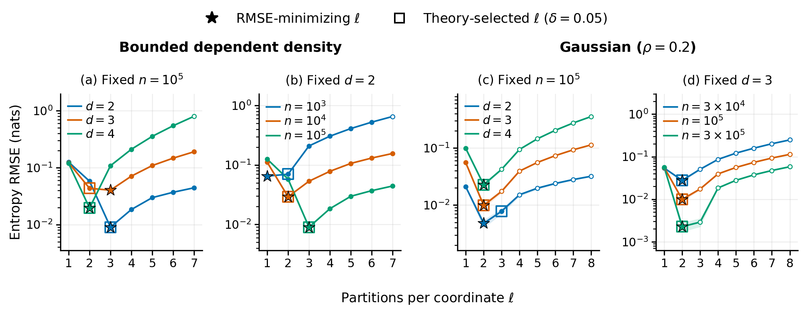

# Partition sensitivity: bounded and Gaussian densities

This folder reproduces the combined four-panel paper figure from frozen result
tables. It does not rerun experiments or modify any RMSE, confidence interval,
or selected partition count.



[Vector PDF](figures/bounded_gaussian_ell_rmse.pdf) |
[Manuscript text and caption](manuscript.tex)

```bash
python -m pip install -r experiments/synthetic_ell_comparison/requirements.txt
python experiments/synthetic_ell_comparison/plot.py
```

The default outputs are `figures/bounded_gaussian_ell_rmse.pdf`, the matching
300 dpi PNG, and `figures/figure_checks.json`, relative to this folder. Use
`--output-dir PATH` to choose another location. The PDF is a vector figure
measuring 7.2 by 2.8 inches, with a minimum text size of 7.5 points.
All four panels form one horizontal row: the bounded model is on the left
and the Gaussian model is on the right.
The plotter was checked with NumPy 1.24.3, pandas 2.0.3 and Matplotlib 3.7.2.

## Panels and frozen data

| Panels | Distribution | Fixed quantity | Varied quantity | Repetitions | Displayed grid |
| --- | --- | --- | --- | --- | --- |
| (a) | Bounded dependent | n = 100,000 | d = 2, 3, 4 | 100 | ell = 1,...,7 |
| (b) | Bounded dependent | d = 2 | n = 1,000; 10,000; 100,000 | 100 | ell = 1,...,7 |
| (c) | Gaussian, rho = 0.2 | n = 100,000 | d = 2, 3, 4 | 30 | ell = 1,...,8 |
| (d) | Gaussian, rho = 0.2 | d = 3 | n = 30,000; 100,000; 300,000 | 30 | ell = 1,...,8 |

Each distribution contributes five unique settings: its anchor setting appears
in both corresponding panels. Stars identify the same-repeat RMSE minimum on the candidate grid;
squares identify the theory-selected ell. Shading retains the saved pointwise
95% bootstrap intervals from 2,000 resamples. Empty circular markers denote
any candidate for which at least one repetition has less than full coverage.
No coverage filter is applied to either minimum. The empirical minima are
descriptive oracle values, not independent test estimates of a tuned selector.

The rule shown by squares minimizes

```text
ell^(-2) + sqrt(2*d*log(2*n+1) + log(96/delta)) * (ell^d/n)^(1/4), delta = 0.05,
```

over the displayed candidate grid, with the smaller integer breaking a tie.
This is the displayed bound-derived criterion, distinct from the rounded
dimension-aware asymptotic rate that is also retained in the Gaussian source
selection table. No coefficient is fitted to the plotted outcomes. A common
positive multiplicative factor does not change the minimizer.

The bounded density is `f(x)=1+0.7*cos(2*pi*(x1-x2))` on `[0,1]^d`, with
exact entropy `-0.13162313217701307` nats. The extra coordinates for d > 2 are
independent uniforms. The density lies between 0.3 and 1.7 and is Lipschitz
on the cube, satisfying the theorem's distributional regularity assumptions.
Finite-sample requirements containing an unspecified constant are not certified.

The Gaussian distributions have zero mean, unit marginal variances, and
equicorrelation rho = 0.2. They extend the comparison beyond the bounded-support
and positive density lower-bound assumptions. Their exact entropy is
`0.5*(d*log(2*pi*e)+(d-1)*log(1-rho)+log(1+(d-1)*rho))` nats.

There are three exact matches among the five bounded settings and four among
the five Gaussian settings. All plotted outcomes are retained, including
disagreements. Exact agreement is descriptive and is not a finite-sample
optimality guarantee.

## Provenance and scope

The four figure input tables are byte-for-byte copies of the corresponding
saved analysis summaries:

| Bundled table | Source analysis directory and file |
| --- | --- |
| `tables/bounded_summary.csv` | `results/synthetic_bounded_fig2_compact_20261006/per_ell_summary.csv` |
| `tables/bounded_selection.csv` | `results/synthetic_bounded_fig2_compact_20261006/optimal_ell_comparison.csv` |
| `tables/gaussian_summary.csv` | `results/synthetic_gaussian_lowdim_20261006/per_ell_summary.csv` |
| `tables/gaussian_selection.csv` | `results/synthetic_gaussian_lowdim_20261006/optimal_ell_comparison.csv` |

The bounded results combine previously audited canonical-estimator archive
results for d = 2 and additional canonical simulations at d = 3, 4. The selected
minima agree with those on every available saved grid, which extends beyond
ell = 7 for the archived d = 2 settings. The Gaussian extension used new seeds
after an exploratory comparison of smaller correlations; it is not a broadly
confirmatory design. The generator's inherited CDF clipping operation affected
zero observations in this extension, and no clipping, redraw, or tuning was
added for this combined figure.

Additional small tables retain the broader exploration:

- `tables/bounded_full_grid_summary.csv`: all saved candidate summaries for
  the five bounded settings, including the candidates outside the plotted range.
- `tables/bounded_expanded_selection.csv`: the previous seven-setting bounded
  selection comparison, including d = 5 and n = 1,000,000.
- `tables/gaussian_previous_rho_selection.csv` and
  `tables/gaussian_previous_rho_agreement.csv`: all 48 settings and the aggregate
  results from the preceding rho = 0, 0.1, ..., 0.5 exploration.

`provenance.json` records original relative source names and byte hashes. The
plotter verifies the frozen table hashes and cross-checks grid membership, replicate counts, selected minima, the
displayed theoretical criterion, and stored RMSE values before exporting. The
bundled summaries suffice to reproduce the figure; they do not replace the raw
simulation archive for reproducing the original fits or bootstrap calculations.
